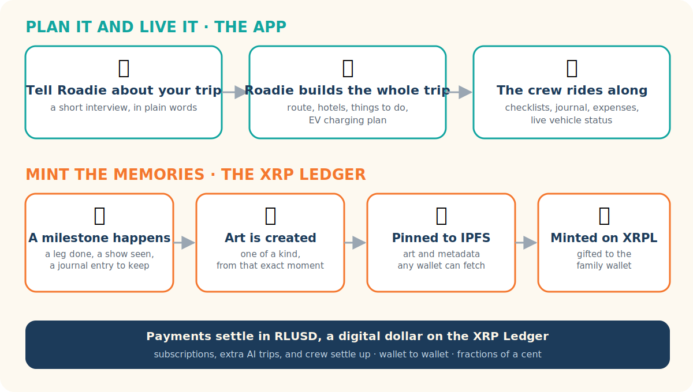

<picture>
  <source media="(prefers-color-scheme: dark)" srcset="assets/epictrip-wordmark-dark.svg">
  
</picture>

**The AI travel agent that builds your family road trip, rides along on the road, and mints the memories on the XRP Ledger.**

Epic Trip is a trip planner for families. You describe the trip you want, and Roadie, the AI
travel agent built into the app, interviews you and builds the whole thing: the route, the
hotels, curated things to do at every stop, planned events, and an EV charging plan. Then the
app rides along during the trip itself, with checklists, a shared journal, group expenses, and
live vehicle status. And as the trip actually happens, its best moments become one of a kind
art collectibles, minted on the XRP Ledger, that the family keeps forever.

> **This repo is the concept and the high level design, not the app's source code.** It exists
> so the Make Waves on XRPL community can see what Epic Trip is and exactly how it uses XRP,
> RLUSD, and the XRP Ledger.

  

## The idea

Planning a big family trip takes weeks, and the memories of it end up scattered across camera
rolls and group chats. Epic Trip fixes both halves.

- **The planning is done by an AI that does real work.** Roadie does not hand you a wall of
  suggestions. It writes an actual, structured, editable trip into the app, down to which
  Supercharger to stop at and what to do with the kids in each town.
- **The memories become keepsakes on a public ledger.** Finish a driving leg, see a show, write
  a journal entry worth keeping, and the app turns that exact moment into one of a kind art and
  mints it to the family's wallet on the XRP Ledger. Not screenshots. Collectibles the family
  owns, viewable in any XRPL wallet, for pennies.

## Why the XRP Ledger

The ledger is the memory and money layer of Epic Trip, and it is what we are building during
Make Waves.

- **Trip Memory NFTs.** Milestones mint automatically as the trip happens. The art is generated
  from the moment itself (a journal entry becomes its own painting), pinned to IPFS with its
  metadata, and minted as an NFT gifted to the family wallet. A nine day road trip produces a
  couple dozen memories for well under a dollar, something only XRPL's tiny fees make sensible.
- **RLUSD payments.** The paid tier and extra AI trips settle in RLUSD, a digital dollar on the
  XRP Ledger. No card fees, no middleman, and the price of a subscription arrives whole.
- **Crew settle up.** The app already tracks who paid for what on the trip. Settle up squares
  the whole crew wallet to wallet in RLUSD for fractions of a cent.
- **We never hold anyone's money.** Every payment is signed in the member's own wallet. The
  only key the app keeps is the badge minter, and it holds pocket change.

## How a memory becomes an NFT

1. A milestone fires inside the app: a leg is completed, an event is attended, a hotel checkout
   passes, or someone flags a journal entry as a keeper.
2. The app generates one of a kind art from that moment.
3. The art and its metadata are pinned to IPFS so any wallet or marketplace can render it.
4. An NFT is minted on the XRP Ledger (one collection per trip) and offered to the family
   wallet so that only they can claim it. Memories are soulbound by default: keepsakes, not
   trading cards.

## Why Epic Trip is different

- Trip organizers (TripIt, Wanderlog) tidy up bookings but cannot create a plan.
- AI chat planners suggest itineraries as text you still have to build somewhere else.
- Epic Trip's AI output **is** the app's live state, the app stays open during the trip, and no
  travel product anywhere mints your trip's memories on a public ledger.

## Under the hood

Epic Trip is a web app with passkey sign in (no passwords, ever) and a family crew model: two
captains, four co pilots, and four read only tagalongs per trip. The XRPL layer is built on the
proven core of **Tiplet**, our earlier Make Waves project: wallet connect (Xaman, GemWallet,
Crossmark), RLUSD settlement verified from the ledger itself, NFT minting via xrpl.js, IPFS
pinning, and AI art generation, all already tested on the XRPL Testnet.

## What we will never claim

- We never take custody of funds. Wallets sign, the ledger settles, we watch.
- Trip Memories are keepsakes, not investments. The art is generated and whimsical.
- The AI plans well, but it is a travel agent, not a guarantee of good weather.

## Status

The app itself is built and running, and a real family road trip happens inside the Make Waves
window, minting its memories as it goes. The build order for the challenge: Trip Memory NFTs on
Testnet, then Mainnet, then the claim flow for individual family members, then RLUSD
subscriptions and settle up.

---

Built by [@realgrapedrop](https://github.com/realgrapedrop). Questions? DM
[@realgrapedrop](https://x.com/realgrapedrop) on X.
